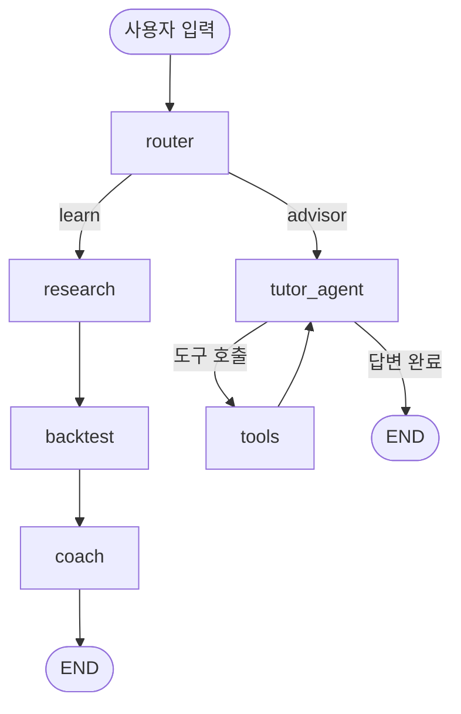

# 📈 TradeTutor v2 — 트레이딩 학습 에이전트 (LangGraph)

> 교육 & 학습 테마 · 데모데이 프로젝트
> ⚠️ **학습·검증용 도구입니다. 투자 조언이 아닙니다.**

---

## 1. 에이전트 소개

**TradeTutor** 는 매매법을 **명확한 규칙**으로 배우고, **실제 코인 데이터**로 검증하며,
**지금 언제 사고 팔지 · 어디서 손절하고 익절할지**까지 데이터로 계산해 *왜 그런지* 가르쳐 주는
트레이딩 학습 에이전트다.

**해결하는 문제**
매번 새 매매법을 배울 때 유튜브·블로그 설명이 "추세 좋을 때 사라" 식으로 애매하고,
진짜 되는 방법인지 백테스트 코드를 직접 짜서 확인해야 하고, 초보라 "지금 이 자리에서
손절·익절을 어디에 둬야 하는지" 판단이 막막하다. TradeTutor 는 이 과정을 한 흐름으로 묶는다.

**두 가지 모드** (에이전트가 입력을 보고 스스로 선택)
- **학습 모드** — 전략을 규칙으로 정리 → 실데이터 백테스트 → 학습 코칭
- **조언 모드** — 지금 시점의 매수/매도 신호 + 진입가·손절가·익절가·손익비를 실데이터로 계산

---

## 2. 아키텍처 (그래프 구조)

```
START → router ─┬─ (route = learn)   → research → backtest → coach → END
                └─ (route = advisor) → tutor_agent ⇄ tools → END
```



### 노드 (6개)
| 노드 | 역할 |
|---|---|
| `router` | 사용자 입력을 **learn / advisor** 로 분류하고, 전략·코인을 추출 |
| `research` | 선택한 전략을 진입/청산 규칙·핵심 원리·주의점으로 정리 (LLM) |
| `backtest` | 실제 코인 데이터에 규칙 적용 → 수익률·승률·MDD (결정적, LLM 없음) |
| `coach` | 백테스트 결과 해석 + 강점/약점 + 다음 실험 제안 (LLM) |
| `tutor_agent` | 도구를 호출해 실시간 타이밍·손절·익절을 계산하고 이유를 설명 (LLM + tools) |
| `tools` | 아래 3개 도구 실행 (`ToolNode`) |

### 조건부 엣지 (Conditional Edge, 2개)
1. **router → 경로 분기**: `route` 값에 따라 학습 경로(`research`) 또는 조언 경로(`tutor_agent`) 로 이동
2. **tutor_agent → 도구 여부**: `tools_condition` — 도구 호출이 있으면 `tools`, 없으면 `END`

### 도구 (Tool, 3개 — 모두 커스텀)
| 도구 | 하는 일 |
|---|---|
| `analyze_timing(symbol, strategy_key)` | ⭐ 실데이터로 **현재 신호 + 진입가 + 손절가(ATR×2) + 익절가(ATR×3) + 손익비 + 지지/저항** 계산 |
| `market_snapshot(symbol)` | 현재가·24h 변동률·고저 |
| `web_search(query)` | 인터넷에서 전략·시장 정보 검색 |

### 메모리
`MemorySaver` 체크포인터 → 같은 `thread_id` 안에서 이전 대화를 기억 (후속 질문 가능).

### State
`messages` · `route` · `strategy_key` · `symbol` · `strategy_rules` · `backtest_result` · `coaching`

---

## 3. 요구사항 충족 체크리스트

- [x] 최소 3개 노드 → **6개**
- [x] 최소 1개 Conditional Edge → **2개** (경로 분기 + 도구 여부)
- [x] 최소 1개 Tool → **3개** (커스텀)
- [x] (선택) 메모리 → `MemorySaver`
- [x] (선택) 여러 개 Tool → 3개
- [x] 에이전트 설명 포함 README (이 문서)

---

## 4. 예시 상호작용

**학습 모드**
```
User: 골든크로스 전략 배우고 싶어
→ [router: learn] → research → backtest → coach
Bot: (진입/청산 규칙) + BTC 백테스트(전략 -14% vs 보유 -44%) + 학습 코칭
```

**조언 모드 (핵심)**
```
User: 지금 비트코인 골든크로스 기준 매수 타이밍이야? 손절·익절은 어디?
→ [router: advisor] → tutor_agent → analyze_timing 도구
Bot: 현재가 63,060 / 신호 관망 / 손절 58,745(-6.8%) / 익절 69,533(+10.3%) / 손익비 1.5:1
     + 왜 그 자리인지(ATR·지지·저항) 설명
```

**메모리**
```
User: 방금 그거 이더리움으로도 알려줘
→ 앞 맥락(골든크로스 타이밍) 기억 → ETH 로 분석
```

---

## 5. 실행 방법

```bash
# 1) 의존성 설치
uv sync

# 2) API 키 설정 — .env 파일
#    OPENAI_API_KEY=sk-...

# 3) 노트북 실행
uv run jupyter notebook assignment13.ipynb
```

노트북을 위에서 아래로 실행하면:
1. 그래프 다이어그램(노드/엣지) 출력
2. **실행 A** — 학습 경로 (규칙 + 백테스트 + 자산곡선 차트)
3. **실행 B** — 조언 경로 (도구 호출 + 진입/손절/익절 + 차트) ⭐
4. **실행 C** — 메모리 (같은 대화 후속 질문)

> 노트북에는 실행 결과와 차트가 이미 채워져 있어, 열면 바로 확인 가능합니다.

## 6. 제출 파일
`assignment13.ipynb` · `README.md` · `pyproject.toml` · `uv.lock` · `.python-version` · `.env.example` · `.gitignore`
(`.env` 는 API 키라 제외 — `.gitignore` 처리됨)

## 7. 기술 스택
LangGraph · OpenAI gpt-4o-mini · Binance 공개 API(코인 시세) · pandas · matplotlib · Jupyter

## 8. 다음 단계
자막·뉴스 리서치 노드 · 사용자 리스크 성향 반영 손절 폭 자동화 · 여러 코인 동시 스캔 · 자동매매 개념 학습
